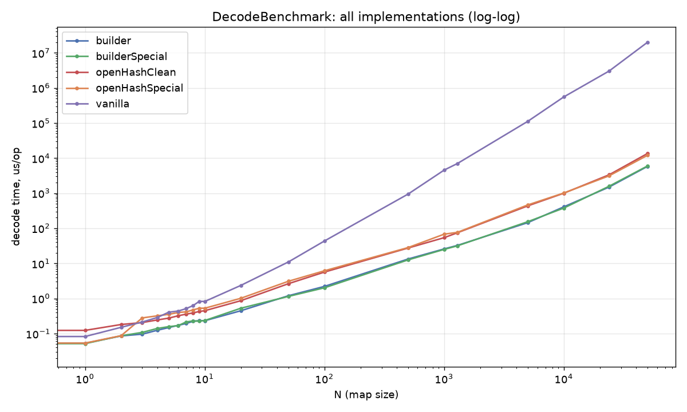
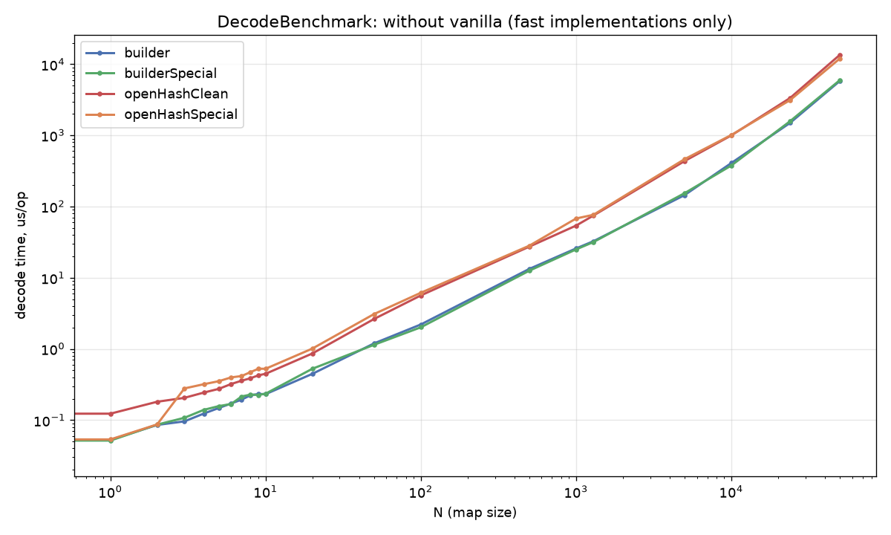
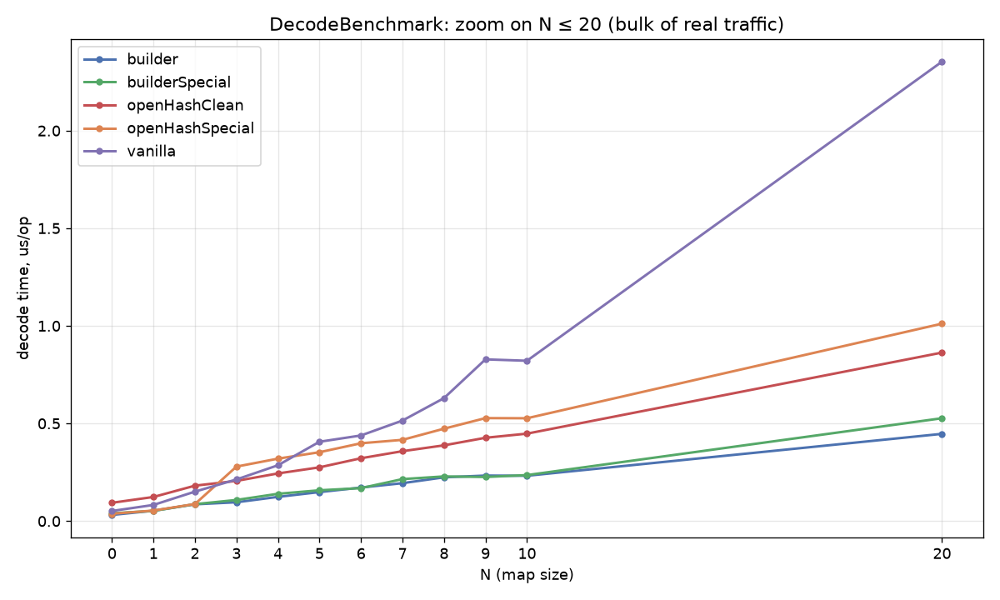
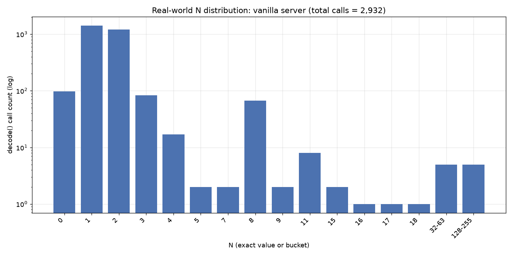
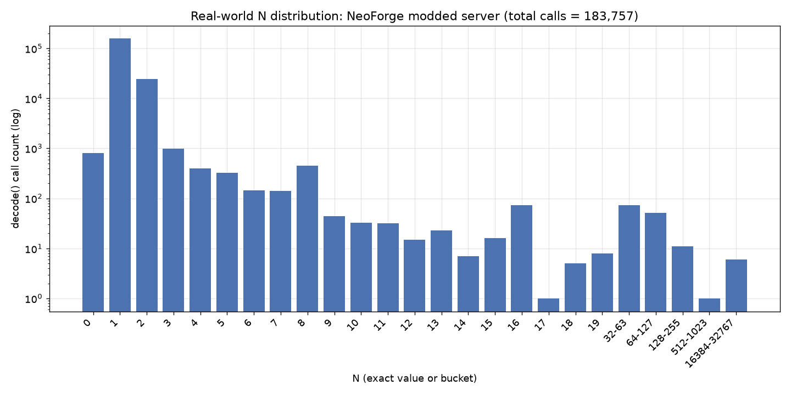
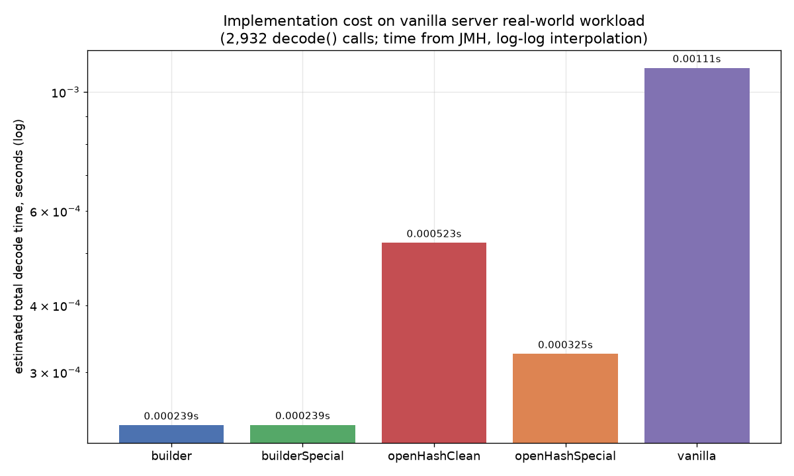
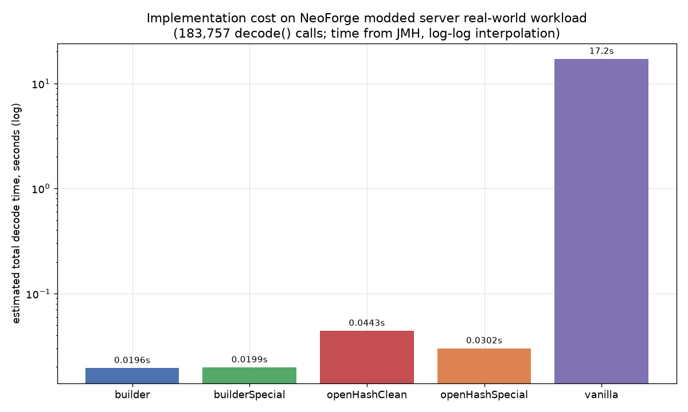
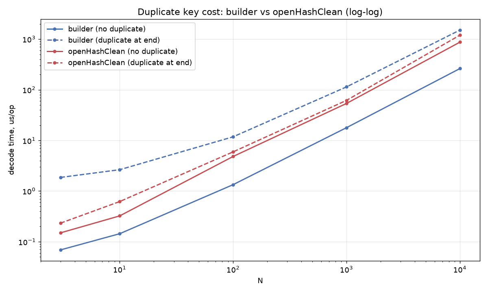

# mapcodec-bench

Benchmark suite for different implementations of `BaseMapCodec.decode()` from DataFixerUpper.

## TL;DR

Current `BaseMapCodec.decode()` uses `Object2ObjectArrayMap`.

`Object2ObjectArrayMap` gives O(N²) and no significant advantage on small N compared to `Object2ObjectOpenHashMap`.

ImmutableMap.Builder with buildOrThrow() and fallback to OpenHashMap gives the best performance in the common case (no duplicates)
and acceptable performance when duplicates occur, since this scenario is rare.

## Why

After [e0b245e](https://github.com/Mojang/DataFixerUpper/commit/e0b245ea8e5a8e86b0ac7aedc0cb3f260ad6c6bc) 
commit `com.mojang.serialization.codecs.BaseMapCodec#decode()`
started to use `Object2ObjectArrayMap` for duplicates check on each put, which causes O(N²) complexity.

It doesn't cause a lot of issues on vanilla, but if you add datapacks or mods with a lot of
advancements, this can cause server lag for **seconds** on **each player join**,
because `decode` will be called with large N.

I have encountered it on 1.21.1 Neoforge modpack with 176 mods, 
`decode()` is called with N=23898, it caused 10+ seconds of lag per join. 

Change from `Object2ObjectArrayMap` to `Object2ObjectOpenHashMap` would give O(N²)->O(N), but it is probably less performant on small N.
(For brevity, the rest of this document refers to these as ArrayMap and OpenHashMap.)

Usage of ArrayMap could be chosen by assumption that `decode()` is used mainly by small N, which is true,
but large N causes catastrophe.

[Measurements of server behavior](#server-behavior-measurements) showed that 
`BaseMapCodec#decode()` calls on vanilla are N<=2 in 93.32% of cases and 98.46% on modded.

N<=2 deserves special attention, it may make sense to make a hybrid implementation.

Duplicate detection logic also introduced double Map allocation: ArrayMap and ImmutableMap.
Now ImmutableMap has a `buildOrThrow()` method, which allows detecting duplicates. Also worth testing.

Based on this I decided to test how different implementations perform.

I made more implementations that aren't represented in the results here — they weren't particularly interesting
in terms of performance. See [What was tried and rejected](#what-was-tried-and-rejected) for details.

## Results

The measurements are made only with Map<String, String>, real `decode()`
may behave differently. But O(N²) complexity for ArrayMap is still here.

Measurements have shown that ArrayMap doesn't give an advantage over OpenHashMap on N>3.
The cross point is close to N=3. OpenHashMap gives slightly worse results at N=1,2.

Hybrid implementation of OpenHashMap using if statements with `Map.of()` for shortcut: 
this hybrid gives better performance than ArrayMap at N<=2, but has overhead compared to clean OpenHashMap on N>2.

`com.google.common.collect.ImmutableMap.Builder` gives better results than clean OpenHashMap and ArrayMap for any N.
On N<=2 results are comparable to special-cased OpenHashMap.

Attempt to add special cases for N=0,1,2 to `ImmutableMap.Builder` didn't give a noticeable advantage;
the results may be slightly worse, but the difference is within the noise floor.

`Map.of()` seems to be equivalent to `ImmutableMap.Builder` in terms of performance.

The only way to detect duplicates with `ImmutableMap.Builder` is via `buildOrThrow()` — there's no cheaper way to check.
Falling back to OpenHashMap solves this, at the cost of extra overhead when a duplicate occurs.

We test the worst case: a duplicate key placed at the end of the input.

Overall duplicate testing results, microseconds/op

| N | builder (no duplicate) | builder (duplicate at end) | openHashClean (no duplicate) | openHashClean (duplicate at end) |
|---:|---:|---:|---:|---:|
| 3 | 0.069 ± 0.003 | 1.858 ± 0.255 | 0.149 ± 0.013 | 0.232 ± 0.021 |
| 10 | 0.144 ± 0.022 | 2.643 ± 0.281 | 0.323 ± 0.013 | 0.621 ± 0.134 |
| 100 | 1.339 ± 0.189 | 11.790 ± 1.055 | 4.824 ± 0.507 | 5.949 ± 1.718 |
| 1000 | 17.875 ± 1.799 | 114.176 ± 15.194 | 53.839 ± 5.770 | 61.880 ± 15.126 |
| 10000 | 262.825 ± 6.834 | 1513.358 ± 155.159 | 874.108 ± 28.392 | 1201.628 ± 135.610 |

Worst duplicate cost.

| N | builder |
|---:|---:|
| 3 | 27× |
| 10 | 18.4× |
| 100 | 8.8× |
| 1000 | 6.4× |
| 10000 | 5.8× |

builder vs openHashClean (how many times faster builder is)

| N | no duplicate | duplicate at end |
|---:|---:|---:|
| 3 | 2.2× | −8.0× (slower) |
| 10 | 2.2× | −4.3× (slower) |
| 100 | 3.6× | −2.0× (slower) |
| 1000 | 3.0× | −1.8× (slower) |
| 10000 | 3.3× | −1.3× (slower) |

The results may seem unsatisfactory.

Though telemetry showed that duplicate cases are extremely rare (0.004% on modded, not detected on vanilla), see telemetry below.

Given how rare it occurs, `ImmutableMap.Builder` implementation seems the best option,
giving best performance for the most often non-problematic case
and acceptable performance for the failure scenario.










## Server behavior measurements

I patched DFU to log the behavior of `BaseMapCodec.decode()`; these are the results.

### Vanilla

```
~20 mins of active server

Max N: 156
That's advancements call

total decode() calls: 2932
below threshold (N<20): 2922 (99.66%)
above threshold (N>=20): 10 (0.34%)
--- size histogram (exact for N<20, power-of-2 buckets for N>=20) ---
N == 0: 97 calls (3.31%)
N == 1: 1421 calls (48.47%)
N == 2: 1218 calls (41.54%)
N == 3: 83 calls (2.83%)
N == 4: 17 calls (0.58%)
N == 5: 2 calls (0.07%)
N == 7: 2 calls (0.07%)
N == 8: 67 calls (2.29%)
N == 9: 2 calls (0.07%)
N == 11: 8 calls (0.27%)
N == 15: 2 calls (0.07%)
N == 16: 1 calls (0.03%)
N == 17: 1 calls (0.03%)
N == 18: 1 calls (0.03%)
N in [32, 63]: 5 calls (0.17%)
N in [128, 255]: 5 calls (0.17%)
--- duplicate/decode-error statistics ---
calls with at least one failed entry: 0 / 2932
total individual failed entries across all calls: 0
```
### Neoforge with 176 mods

```
~4 hours of active server

Max N: 23898
That's advancements call

total decode() calls: 183757
below threshold (N<20): 183615 (99.92%)
above threshold (N>=20): 142 (0.08%)
--- size histogram (exact for N<20, power-of-2 buckets for N>=20) ---
N == 0: 814 calls (0.44%)
N == 1: 155855 calls (84.82%)
N == 2: 24248 calls (13.20%)
N == 3: 976 calls (0.53%)
N == 4: 395 calls (0.21%)
N == 5: 327 calls (0.18%)
N == 6: 146 calls (0.08%)
N == 7: 141 calls (0.08%)
N == 8: 455 calls (0.25%)
N == 9: 44 calls (0.024%)
N == 10: 33 calls (0.018%)
N == 11: 32 calls (0.017%)
N == 12: 15 calls (0.008%)
N == 13: 23 calls (0.013%)
N == 14: 7 calls (0.004%)
N == 15: 16 calls (0.009%)
N == 16: 74 calls (0.040%)
N == 17: 1 calls (0.0005%)
N == 18: 5 calls (0.003%)
N == 19: 8 calls (0.004%)
N in [32, 63]: 73 calls (0.040%)
N in [64, 127]: 51 calls (0.028%)
N in [128, 255]: 11 calls (0.006%)
N in [512, 1023]: 1 calls (0.0005%)
N in [16384, 32767]: 6 calls (0.003%)
--- duplicate/decode-error statistics ---
calls with at least one failed entry: 7 / 183757
total individual failed entries across all calls: 9
```

## Benchmark classes

- **`DecodeBenchmark`** -- various `decode()` implementations using
  `Codec`/`DataResult`/`MapLike`/`JsonOps` types:
  - `vanilla`: the real, unmodified `UnboundedMapCodec`.
  - `openHashClean`: minimal fix -- swap the accumulator to `Object2ObjectOpenHashMap`
  - `openHashSpecial`: OpenHashMap with conditions for N=0,1,2, so it avoids creating one when it isn't needed
  - `builder`: strongest candidate -- `ImmutableMap.Builder` + `buildOrThrow()` on duplicates with fallback to OpenHashMap
  - `builderSpecial`: builder with conditions for N=0,1,2, so it avoids creating a Builder when it isn't needed
- **`DuplicateKeyCostBenchmark`** -- quantifies the cost of
  `builderDecode`'s rare exception path (duplicate key), rather than
  assuming it's free. Real telemetry: ~0.004% of calls hit this path on modpack, 0% on vanilla.

## Running

```
./gradlew jmh
```

Or to run specific test

```
./gradlew jmhJar
java -jar build/libs/mapcodec-bench-1.0.0-jmh.jar DecodeBenchmark -rf json -rff decode.json
java -jar build/libs/mapcodec-bench-1.0.0-jmh.jar DuplicateKeyCostBenchmark -rf json -rff dupcost.json
```

## Generating charts

```
pip install matplotlib   # if not already installed
python charts/generate_charts.py results.json
```

The script auto-detects which benchmarks are present in the given
`results.json` and generates whichever charts apply (headline
accumulator comparison, full decode() comparison, small-N zoom,
telemetry-weighted real-world impact, duplicate-key cost).

## What was tried and rejected
 
- **Extending the `Map.of()` special case beyond N=2** (up to N=10, using
  the full JDK overload ladder): a generic dispatch helper regressed the
  dominant N=1/2 -- N=3..10 combined is ~1.37% of telemetry calls, vs ~98% for N<=2.
- **`Stream.collect(Collectors.toMap(...))`**: loses badly at N<100,
  wins at N>=100 (up to ~1.37x at N=5000-50000) by cleanly separating
  the parse phase from the accumulate phase -- interesting, but not
  adopted since `builder` wins at large N too, without needing
  this restructuring, and `Collectors.toMap`'s merge-function API loses
  precise duplicate-pair tracking needed for accurate error reporting.
- **A plain imperative for-loop instead of `Stream.reduce()`**: measured
  slower than `Stream.reduce()` at every N tested (4-41%). 
- **Peeking size via `entries().count()` called twice, or via
  `Spliterator.getExactSizeIfKnown()`** (to avoid materializing into a
  `List` before deciding the strategy): both real, but the count()-twice
  approach is unsafe in general (relies on the specific `DynamicOps`
  implementation recreating a fresh stream per call -- true for
  `JsonOps`/`NbtOps` by source inspection, not guaranteed by the
  `MapLike` contract), and the `Spliterator`-based safe version measured
  1.7-2.2x slower than plain `.toList()` at N=1/2.
